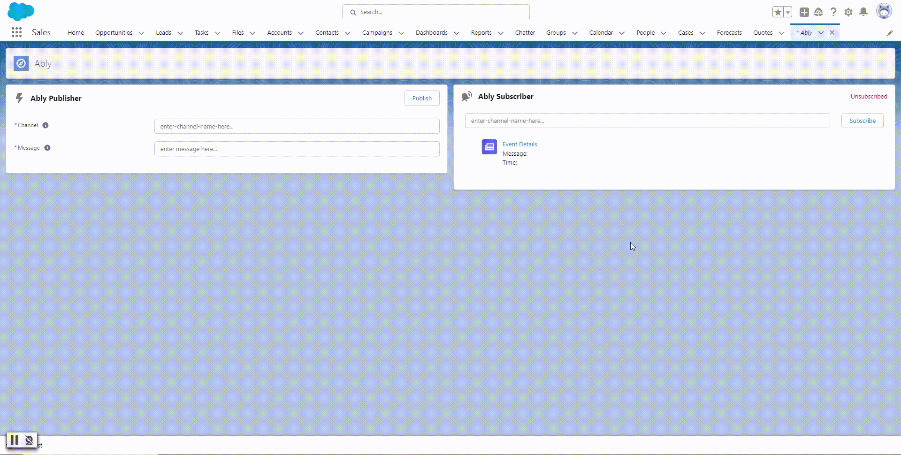

# SFDC Ably Project

Created a simple project that integrates Salesforce with Ably. 

## What is Ably?

[Ably](https://ably.com/) is a third party pub/sub system allowing clients to create event channels and then publish to those channels and/or subscribe to those channels. The value add is that the Ably platform allows discrete systems to be connected and responsive to one another through a pub/sub, event-driven architecture without requiring clients to set up dedicated pub/sub systems or integrations. Ably offers [APIs and SDKs for developers](https://ably.com/docs) to get apps up and running quickly.

## What is this repo?

This repository houses a demo POC that connects Salesforce to Ably as both a publisher and a subscriber. 

The _publisher_ LWC allows a user to send a simple text message to a specified channel on Ably. The Ably channel gets created (if it doesn't already exist) when the message is published. The _publisher_ component works by calling out to Ably through the _Ably_ Apex class, which makes a REST API call.

The _subscriber_ LWC allows a user to subscribe to a channel. Whenever a message is published to the subscribed channel in Ably, the subscriber shows the most recent message's details in the UI. In Ably, a Webhook is defined to send a notification to the _AblyRestResource_ Apex REST Resource whenever a message is published to any channel. The _AblyRestResource_ class, upon receipt of a request, creates an _Ably_Event__e_ Platform Event. Finally, the _subscriber_ LWC works by actually listening for _Ably_Event__e_ Platform Events and then only showing messages sent to the specified Ably channel.

The _AblyRestResource_ is made accessible to the Ably Webhook service through a Public Site. There is a nice demo of how to set up a Site and Webhook integration into Salesforce here: [Salesforce Integration using Webhooks](https://www.apexhours.com/salesforce-integration-using-webhooks/)

### Repo components

- Apex
    - *Ably* - this class contains methods for interacting with Ably. Currently, there is only one method that allows publishing to an event channel.
    - *AblyRestResource* - this class handles Webhook events from Ably and creates Ably_Event__e Platform Events
- LWC
    - *publisher* - this LWC allows a user to send a message to a specified channel. The LWC invokes an Apex method to make a REST API call to Ably to publish the message.
    - *subscriber* - this LWC allows a user to subscribe to an Ably channel. It operates by listening for Ably_Event__e Platform Events and then only paying attention to events on the appropriate Ably channel.

## Ably Configuration

This implementation relies on an outgoing Ably Webhook to send a notification to the Salesforce Org's Ably Rest Resource (defined by the *AblyRestResource* Apex Class). 

The outgoing Webhook is defined in the Ably Dashboard within the Ably app being used in the project or implementation. To create and manage webhook events for your Ably app

1. Navigate to the [Ably Dashboard](ably.com/login)
2. Click on the relevant app
3. Click on the *Integrations* tab
4. See *Integration Rules* - Integration Rules are used to push/stream data to webhooks, queues, or streams whenever an Ably Event is registered.

To set up an outgoing webhook, 

1. Click *New Integration Rule*
2. Choose *Webhook*
3. Choose *Webhook* again to send a webhook event to a custom (Salesforce) endpoint
4. Enter the endpoint of your Apex Rest Resource in the URL field
5. Set *Headers* to "Content-Type:application/json"
6. Set *Encoding* to JSON

## Notes

- LWC tests for components in this repo have not been developed
- We recommend reviewing Apex Test Classes and adding test cases for your specific implementation

## Resources

- [Ably Docs](https://ably.com/docs)